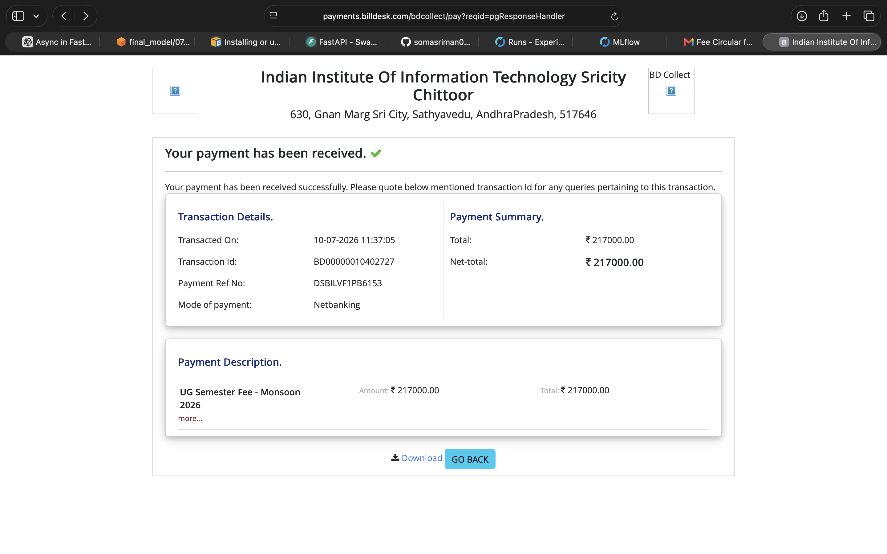
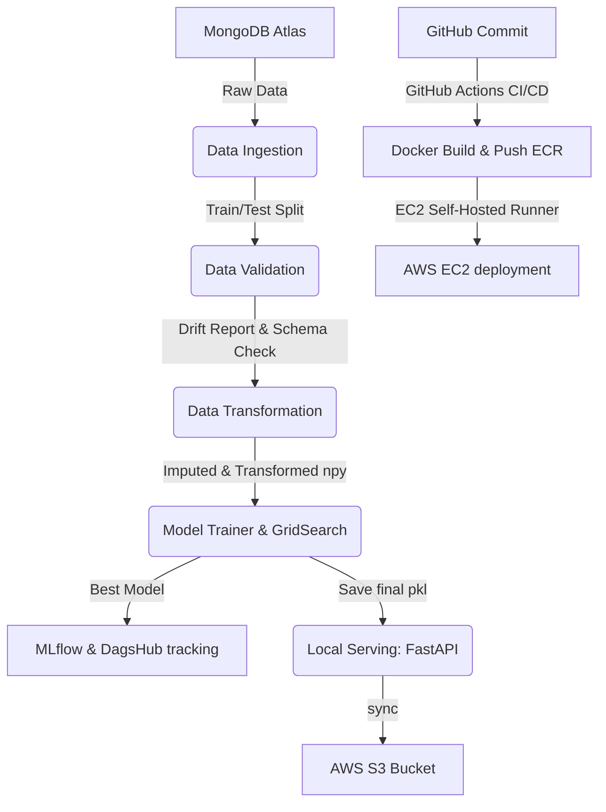

# Network Security: Phishing Data Classification Pipeline

This repository implements an end-to-end Machine Learning and MLOps pipeline designed to detect and classify phishing websites based on network security features. It demonstrates best practices in clean code, robust software engineering, containerization, and automated cloud deployment.

---

## 🚀 Key Skills & Technologies Demonstrated
* **Machine Learning & Tuning**: Random Forest, Gradient Boosting, AdaBoost, Decision Tree, Logistic Regression, Grid Search CV.
* **MLOps & Experiment Tracking**: MLflow, DagsHub Experiment Logs, MLflow Model Registry.
* **Cloud & DevOps**: AWS (EC2, S3, ECR), Docker containerization, GitHub Actions (CI/CD).
* **API Development**: FastAPI, Uvicorn, Jinja2 Templates.
* **Database & Storage**: MongoDB Atlas, Boto3, AWS CLI.

---

## 🏆 Model Evaluation & Best Performance

After running the training pipeline and evaluating multiple classification algorithms using Grid Search CV, the **Random Forest Classifier** emerged as the best-performing model.

### MLflow Run Metrics:
* **F1-Score**: **99.06%**
* **Recall (Sensitivity)**: **99.41%**
* **Precision**: **98.72%**

These metrics indicate an exceptionally low false-negative rate, which is critical for phishing detection (minimizing the risk of a user visiting a malicious site marked as safe).

### MLflow Experiment Dashboard:


---

## 🛠️ Project Architecture



---

## 1. Local Setup

### Setup Virtual Environment
```bash
python -m venv .venv
source .venv/bin/activate
pip install -r requirements.txt
```

### Configure Environment Variables
Create a `.env` file in the root directory:
```env
MONGO_DB_URL="your_mongodb_atlas_connection_string"
```

### Running Training Locally
To trigger the training pipeline locally:
```bash
python main.py
```

### Running FastAPI Server Locally
To launch the API endpoint for predictions and dashboard:
```bash
uvicorn app:app --reload
```
Open **`http://localhost:8000/docs`** to test the API.

---

## 2. GitHub Secrets Setup

Navigate to your GitHub repository -> **Settings** -> **Secrets and variables** -> **Actions**, and add the following repository secrets to run the CI/CD pipeline:

```env
AWS_ACCESS_KEY_ID = <your_aws_access_key_id>
AWS_SECRET_ACCESS_KEY = <your_aws_secret_access_key>
AWS_REGION = us-east-1
AWS_ECR_LOGIN_URI = 788614365622.dkr.ecr.us-east-1.amazonaws.com
ECR_REPOSITORY_NAME = networkssecurity
MONGO_DB_URL = <your_mongodb_connection_string>
```

---

## 3. Docker Setup In EC2 (To Be Executed on EC2 Instance)

Connect to your EC2 instance and run the following commands to install Docker and configure user permissions:

```bash
# Optional system updates
sudo apt-get update -y
sudo apt-get upgrade -y

# Required Docker Installation
curl -fsSL https://get.docker.com -o get-docker.sh
sudo sh get-docker.sh

# Add ubuntu user to Docker group (allows running docker without sudo)
sudo usermod -aG docker ubuntu
newgrp docker
```

Once Docker is installed, configure your **GitHub Self-Hosted Runner** on the EC2 instance (under **Settings** -> **Actions** -> **Runners** in your GitHub repo) to connect the deployment pipeline.